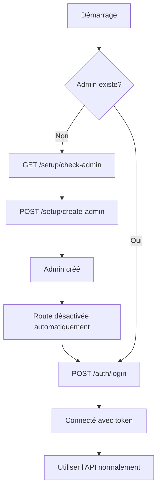

# 🚀 Route de secours - Création manuelle de l'admin

## Problème résolu

Si l'admin automatique n'est pas créé au démarrage, vous pouvez maintenant le créer **manuellement via une route API**.

## ✅ Nouvelle route de setup (SANS authentification)

### 1. Vérifier si un admin existe

**Endpoint:** `GET /setup/check-admin`

```bash
curl https://api.cloud.audace.ovh/setup/check-admin
```

**Réponse si aucun admin :**
```json
{
  "admin_exists": false,
  "setup_needed": true,
  "admin_count": 0,
  "message": "Aucun admin trouvé. Utilisez POST /setup/create-admin pour créer le premier admin."
}
```

**Réponse si un admin existe :**
```json
{
  "admin_exists": true,
  "setup_needed": false,
  "admin_count": 1,
  "message": "1 admin(s) trouvé(s). Le système est configuré."
}
```

### 2. Vérifier les variables d'environnement

**Endpoint:** `GET /setup/env-check`

Cette route permet de vérifier si vos variables d'environnement personnalisées sont bien chargées.

```bash
curl https://api.cloud.audace.ovh/setup/env-check
```

**Réponse :**
```json
{
  "environment_variables": {
    "ADMIN_USERNAME": {
      "defined": true,
      "value": "admin",
      "source": "environment"
    },
    "ADMIN_PASSWORD": {
      "defined": true,
      "value": "***MASKED***",
      "source": "environment"
    },
    "ADMIN_EMAIL": {
      "defined": false,
      "value": "admin@audace.local",
      "source": "default"
    },
    "ADMIN_NAME": {
      "defined": false,
      "value": "Administrateur",
      "source": "default"
    },
    "ADMIN_FAMILY_NAME": {
      "defined": false,
      "value": "Système",
      "source": "default"
    }
  },
  "help": "Les variables avec 'source: environment' sont définies dans vos variables d'environnement. Les autres utilisent les valeurs par défaut du code."
}
```

**Interprétation :**
- `"defined": true` + `"source": "environment"` → Variable personnalisée chargée ✅
- `"defined": false` + `"source": "default"` → Valeur par défaut utilisée ⚠️
- `ADMIN_PASSWORD` est toujours masqué pour la sécurité

**Utilité :**
- Diagnostiquer pourquoi vos credentials personnalisés ne sont pas utilisés
- Vérifier que Dokploy transmet bien les variables au conteneur
- Débugger les problèmes de configuration

### 3. Créer le premier admin (si aucun n'existe)

**Endpoint:** `POST /setup/create-admin`

⚠️ **IMPORTANT** : Cette route :
- Ne nécessite **AUCUNE authentification**
- Est automatiquement **DÉSACTIVÉE** si un admin existe déjà
- Doit être utilisée **UNIQUEMENT** pour la configuration initiale

**Via cURL :**
```bash
curl -X POST "https://api.cloud.audace.ovh/setup/create-admin" \
  -H "Content-Type: application/json" \
  -d '{
    "username": "admin",
    "email": "admin@audace.local",
    "password": "VotreMotDePasseSecurise123!",
    "name": "Administrateur",
    "family_name": "Système"
  }'
```

**Via Swagger UI :**
1. Allez sur `https://api.cloud.audace.ovh/docs`
2. Cherchez la section **"Setup - Configuration initiale"**
3. Cliquez sur `POST /setup/create-admin`
4. Cliquez sur "Try it out"
5. Remplissez les champs :
   ```json
   {
     "username": "admin",
     "email": "admin@audace.local",
     "password": "VotreMotDePasseSecurise123!",
     "name": "Administrateur",
     "family_name": "Système"
   }
   ```
6. Cliquez sur "Execute"

**Réponse (succès) :**
```json
{
  "success": true,
  "message": "Premier administrateur créé avec succès!",
  "admin": {
    "id": 1,
    "username": "admin",
    "email": "admin@audace.local",
    "name": "Administrateur Système"
  },
  "next_steps": [
    "1. Connectez-vous avec vos credentials via POST /auth/login",
    "2. Cette route /setup/create-admin est maintenant DÉSACTIVÉE",
    "3. Changez votre mot de passe via PUT /users/{user_id}",
    "4. Créez d'autres utilisateurs via POST /users"
  ]
}
```

**Réponse si un admin existe déjà (403 Forbidden) :**
```json
{
  "error": "Setup déjà effectué",
  "message": "Au moins un administrateur existe déjà dans le système.",
  "admin_count": 1,
  "help": "Cette route est désactivée pour des raisons de sécurité. Utilisez /auth/login pour vous connecter."
}
```

### 3. Vérifier le statut du système

**Endpoint:** `GET /setup/status`

```bash
curl https://api.cloud.audace.ovh/setup/status
```

**Réponse :**
```json
{
  "system_status": "ready",
  "database_connected": true,
  "admin_role_exists": true,
  "admin_count": 1,
  "total_users": 1,
  "setup_route_active": false,
  "setup_url": null,
  "message": "Système configuré"
}
```

## 📋 Procédure complète de configuration

### Étape 1 : Vérifier l'état du système

```bash
curl https://api.cloud.audace.ovh/setup/check-admin
```

### Étape 2 : Si aucun admin n'existe, créer le premier

```bash
curl -X POST "https://api.cloud.audace.ovh/setup/create-admin" \
  -H "Content-Type: application/json" \
  -d '{
    "username": "admin",
    "email": "votre.email@domaine.com",
    "password": "MotDePasseTresSecurise123!",
    "name": "Votre",
    "family_name": "Nom"
  }'
```

### Étape 3 : Se connecter avec les credentials créés

```bash
curl -X POST "https://api.cloud.audace.ovh/auth/login" \
  -H "Content-Type: application/x-www-form-urlencoded" \
  -d "username=admin&password=MotDePasseTresSecurise123!"
```

### Étape 4 : Récupérer votre profil

```bash
curl -X GET "https://api.cloud.audace.ovh/users/me" \
  -H "Authorization: Bearer VOTRE_TOKEN"
```

### Étape 5 : Changer le mot de passe (recommandé)

```bash
curl -X PUT "https://api.cloud.audace.ovh/users/1" \
  -H "Authorization: Bearer VOTRE_TOKEN" \
  -H "Content-Type: application/json" \
  -d '{"password": "NouveauMotDePasseEncorePlusSecurise456!"}'
```

## 🔒 Sécurité

### ✅ Points de sécurité

1. **Route automatiquement désactivée** : Dès qu'un admin existe, la route retourne une erreur 403
2. **Logs détaillés** : Toutes les tentatives sont loggées
3. **Vérification double** : Le code vérifie toujours qu'aucun admin n'existe avant de créer
4. **Pas d'authentification requise** : Nécessaire uniquement pour la première configuration

### ⚠️ Recommandations

1. **Utilisez un mot de passe fort** : Minimum 12 caractères avec majuscules, minuscules, chiffres et symboles
2. **Changez le mot de passe** : Changez-le immédiatement après la première connexion
3. **Utilisez un email valide** : Pour la récupération de mot de passe
4. **Désactivez la route après** : Une fois l'admin créé, la route est automatiquement désactivée

## 🐛 Débogage

### La route retourne 403 mais je n'ai pas d'admin

Si la route dit qu'un admin existe mais vous ne pouvez pas vous connecter :

```bash
# 1. Vérifier dans la base de données
docker exec -it <postgres_container> psql -U audace_user -d audace_db

# 2. Lister les admins
SELECT u.id, u.username, u.email, u.is_active, u.is_deleted
FROM users u
JOIN user_roles ur ON u.id = ur.user_id
JOIN roles r ON ur.role_id = r.id
WHERE r.name = 'Admin';

# 3. Si un admin existe mais est inactif ou supprimé, le réactiver
UPDATE users SET is_active = true, is_deleted = false WHERE id = 1;

# 4. Ou supprimer complètement l'admin pour recréer
DELETE FROM user_roles WHERE user_id = 1;
DELETE FROM user_permissions WHERE user_id = 1;
DELETE FROM users WHERE id = 1;
```

Puis redémarrez l'application et recréez l'admin via `/setup/create-admin`.

### La route retourne 500

Si vous obtenez une erreur 500 :

1. **Vérifiez les logs** :
   ```bash
   docker-compose logs -f | grep "SETUP:"
   ```

2. **Vérifiez la connexion à la base de données** :
   ```bash
   curl https://api.cloud.audace.ovh/setup/status
   ```

3. **Vérifiez que les migrations sont appliquées** :
   ```bash
   docker-compose exec api alembic current
   docker-compose exec api alembic upgrade head
   ```

## 📝 Exemples avec Postman

### 1. Vérifier si un admin existe

```
Method: GET
URL: https://api.cloud.audace.ovh/setup/check-admin
Headers: (aucun)
```

### 2. Créer l'admin

```
Method: POST
URL: https://api.cloud.audace.ovh/setup/create-admin
Headers:
  Content-Type: application/json
Body (raw JSON):
{
  "username": "admin",
  "email": "admin@audace.local",
  "password": "Admin@2024!SecurePassword",
  "name": "Administrateur",
  "family_name": "Système"
}
```

### 3. Se connecter

```
Method: POST
URL: https://api.cloud.audace.ovh/auth/login
Headers:
  Content-Type: application/x-www-form-urlencoded
Body (x-www-form-urlencoded):
  username: admin
  password: Admin@2024!SecurePassword
```

## 🎯 Workflow complet



## ✅ Avantages de cette approche

1. ✅ **Pas besoin de redéployer** : Créez l'admin directement via l'API
2. ✅ **Pas besoin d'accès à la base** : Tout se fait via HTTP
3. ✅ **Sécurisé** : Route automatiquement désactivée après utilisation
4. ✅ **Logs complets** : Toutes les actions sont loggées
5. ✅ **Facile à utiliser** : Via Swagger UI, cURL ou Postman
6. ✅ **Pas d'authentification** : Nécessaire uniquement pour la première config

---

**Dernière mise à jour** : 11 décembre 2025  
**Route active uniquement si** : Aucun admin n'existe dans le système
